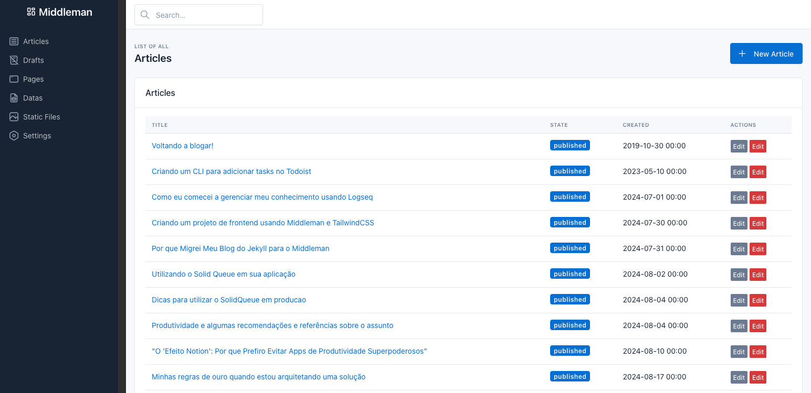
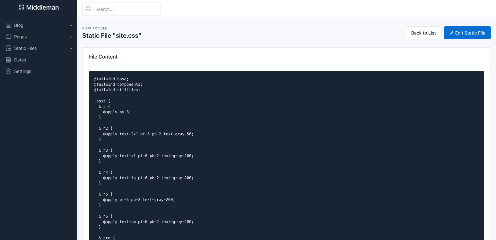
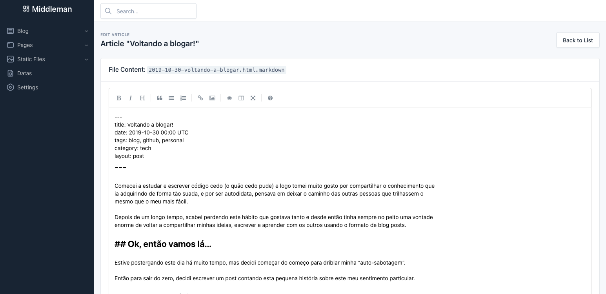

# Middleman Admin

Middleman Admin is a simple and flexible interface for managing Middleman site data. It is designed to be easily added
to an existing Middleman project and configured to manage the data you want to manage.

This project is in the early stages of development and is not yet ready for use and its highly inspired by [Jekyll
Admin](https://github.com/jekyll/jekyll-admin).

## Installation

For now, you need to copy the `admin.rb` file to your Middleman project's root directory.

## Screenshots

_See and update editable assets like css, js and other files_

_Edit your articles using a visual editor_

## Author

[Daniel Vinciguerra](https://github.com./dvinciguerra)
